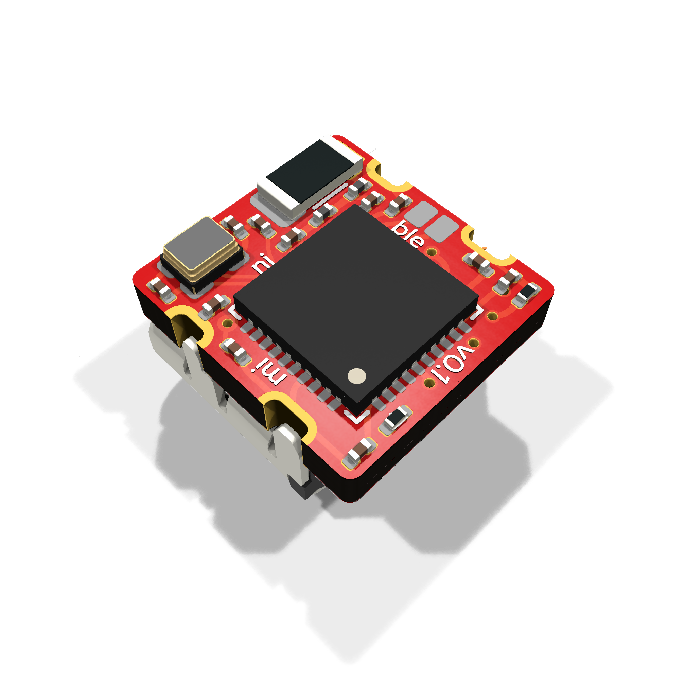
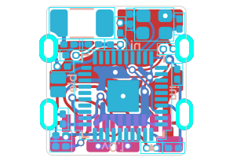
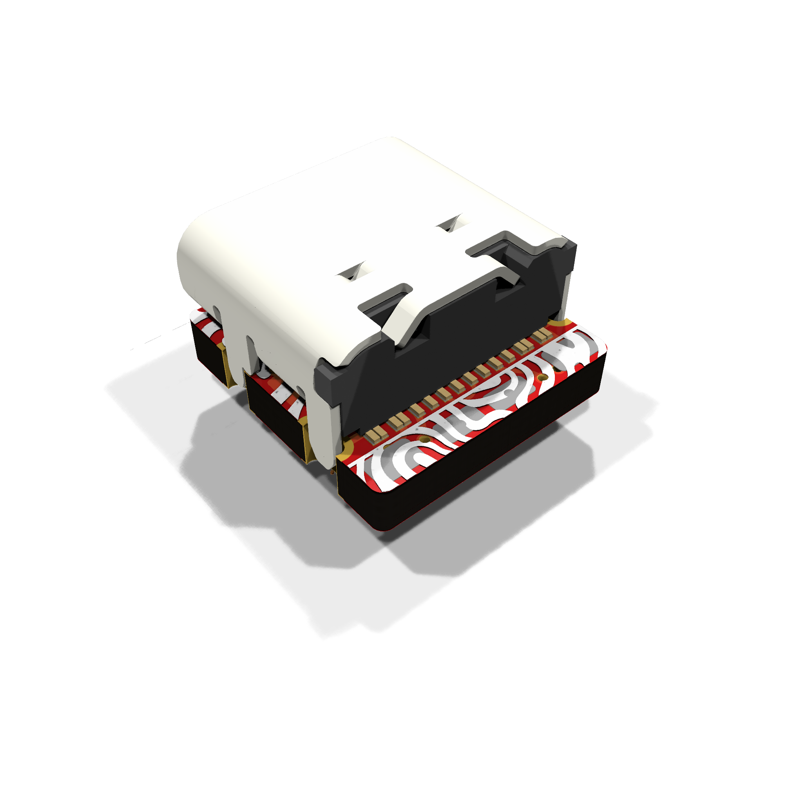
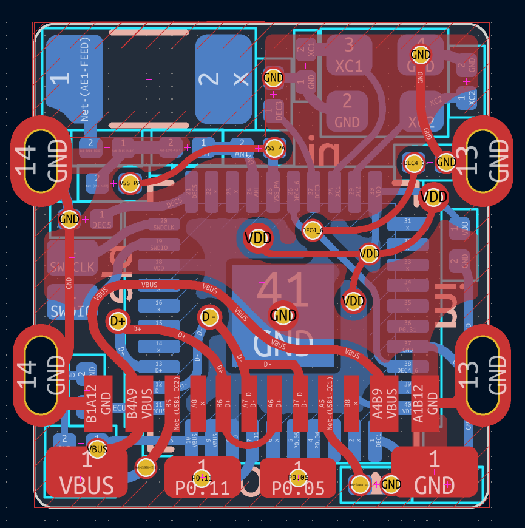
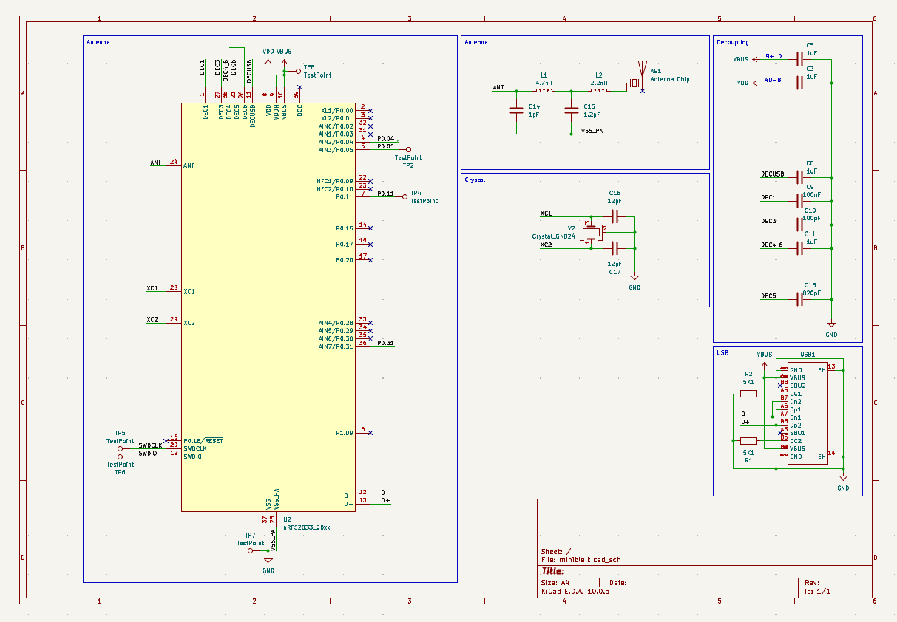

    <h1>
        minible
    </h1>
    

        <strong>
            very mini devboard with BLE and USB
        </strong>
    

    

        <a href="#features">features</a> •
        <a href="#pcb">PCB</a> •
        <a href="#schematics">schematics</a>
    

    
    

## features

- tiny! just 8.5*9mm
- based on the nRF52833
- USB-C (full speed)
- 2 GPIOs (1 analog input)
    - P0.05, P0.11
- BLE, Thread, Matter, ANT support

## PCB

Production and BOM files are under `production/`

## schematics

